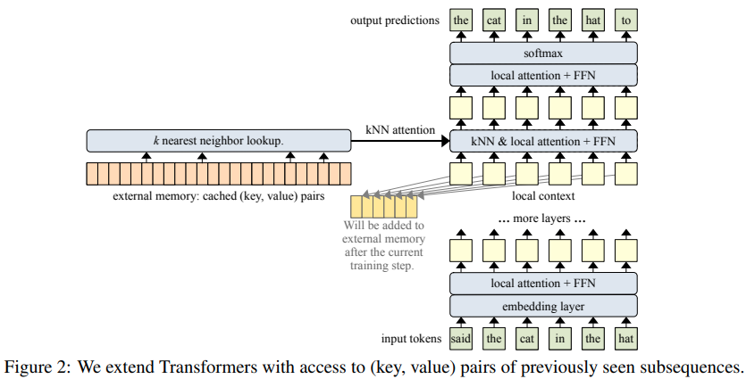

</img>

## Memorizing Transformers - Pytorch

Implementation of <a href="https://arxiv.org/abs/2203.08913">Memorizing Transformers</a> (ICLR 2022), attention net augmented with indexing and retrieval of memories using approximate nearest neighbors, in Pytorch

## Install

```bash
$ pip install memorizing-transformers-pytorch
```

## Usage

```python
import torch
from memorizing_transformers_pytorch import MemorizingTransformer

model = MemorizingTransformer(
    num_tokens = 20000,                 # number of tokens
    dim = 512,                          # dimension
    dim_head = 64,                      # dimension per attention head
    depth = 8,                          # number of layers
    memorizing_layers = (4, 5),         # which layers to have ANN memories
    max_knn_memories = 2048,            # maximum ANN memories to keep (oldest ones will be discarded)
    num_retrieved_memories = 32,        # number of ANN memories to retrieve
    clear_memories_on_sos_token_id = 1, # clear passed in ANN memories automatically for batch indices which contain this specified SOS token id - otherwise, you can also manually iterate through the ANN memories and clear the indices before the next iteration
)

data = torch.randint(0, 20000, (1, 4, 1024)) # (batch, segments, seq)

logits1, knn_memories = model(data[:, 0]) # will instantiate new ANN memories if not given

logits2, _ = model(data[:, 1], knn_memories = knn_memories)
logits3, _ = model(data[:, 2], knn_memories = knn_memories)
logits4, _ = model(data[:, 3], knn_memories = knn_memories)

# logits - (1, 1024, 20000)
# ann memories - List[ANNMemory]

# ... and so on
```

## ANN Memory

This repository contains a wrapper around Faiss that can automatically store and retrieve key / values

```python
import torch
from memorizing_transformers_pytorch import KNNMemory

memory = KNNMemory(
    dim = 64,                   # dimension of key / values
    max_memories = 1024,        # maximum number of memories to keep (will throw out the oldest memories for now if it overfills)
    num_indices = 2             # this should be equivalent to batch dimension, as each batch keeps track of its own memories, expiring when it sees a new document
)

memory.add(torch.randn(2, 512, 2, 64))  # (batch, seq, key | value, feature dim)
memory.add(torch.randn(2, 512, 2, 64))

memory.clear([0]) # clear batch 0, if it saw an <sos>

memory.add(torch.randn(2, 512, 2, 64))
memory.add(torch.randn(2, 512, 2, 64))

key_values, mask = memory.search(torch.randn(2, 512, 64), topk = 32)
```

## Todo

- [ ] write alternative gating that takes into account number of retrieved memories as well as positions using continuous MLP representation
- [ ] complete transformer-xl with appropriate memory storing and retrieval strategies
- [ ] take care of cross entropy loss if labels passed in
- [ ] enwik8 demo

## Citations

```bibtex
@article{wu2022memorizing,
  title   = {Memorizing transformers},
  author  = {Wu, Yuhuai and Rabe, Markus N and Hutchins, DeLesley and Szegedy, Christian},
  journal = {arXiv preprint arXiv:2203.08913},
  year    = {2022}
}
```

```bibtex
@article{Shazeer2019FastTD,
  title   = {Fast Transformer Decoding: One Write-Head is All You Need},
  author  = {Noam M. Shazeer},
  journal = {ArXiv},
  year    = {2019},
  volume  = {abs/1911.02150}
}
```
